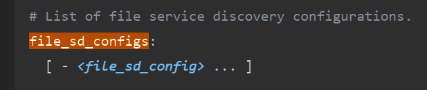
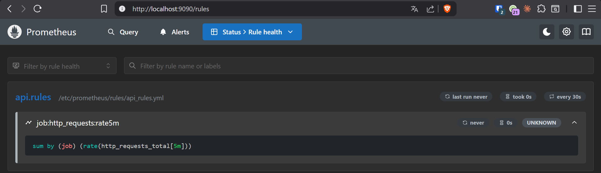

# Observabilite

Compte-rendu du TP Docker etudiant "Observabilite avec Prometheus, Grafana et Thanos".

Je me suis arrete a l'exercice 9 du module Prometheus. Ce README retrace les exercices realises, les fichiers utilises dans ce depot, les reponses aux questions en s'appuyant sur les captures du dossier `image/`, et une copie du sujet pour garder le contexte du TP.

## Etat d'avancement

- Module 1 - Prometheus : exercices 1 a 9 realises
- Module 1 - Exercice 10 : non commence
- Module 2 - Grafana : non commence
- Module 3 - Thanos : non commence

## Contenu du depot

- `docker-compose.yml` : stack locale avec `prometheus`, `node`, `alertmanager` et `demo-api`
- `prometheus.yml` : configuration Prometheus
- `targets.json` : decouverte de cibles par fichier
- `rules/api_rules.yml` : recording rules pour les exercices 5, 8 et 9
- `alerts/api_alerts.yml` : regle d'alerte de l'exercice 6
- `alertmanager/alertmanager.yml` : configuration minimale d'Alertmanager
- `app.py` : API Flask instrumentee avec des metriques Prometheus
- `traffic.sh` : generation de trafic sur `/api/users` et `/api/orders`
- `image/` : captures d'ecran et sujet du TP

## Lancement du projet

```bash
docker compose up --build
```

Services exposes :

- Prometheus : `http://localhost:9090`
- Alertmanager : `http://localhost:9093`
- demo-api : `http://localhost:8000`
- metriques demo-api : `http://localhost:8000/metrics`

Generation de trafic :

```bash
./traffic.sh
```

## Compte-rendu des exercices 1 a 9

### Exercice 1 - Installer Prometheus et acceder a l'interface web

Objectif atteint : Prometheus est accessible sur le port `9090`, et l'interface web permet de verifier l'etat des cibles.

### Exercice 2 - Ecrire son premier `prometheus.yml`

Le fichier [`prometheus.yml`](prometheus.yml) contient :

- `scrape_interval: 10s`
- `external_labels.environment: lab`
- l'activation du rechargement via `--web.enable-lifecycle` dans [`docker-compose.yml`](docker-compose.yml)

### Exercice 3 - Ajouter `node_exporter`

Le service `node` est defini dans [`docker-compose.yml`](docker-compose.yml) et il est scrape par Prometheus via la decouverte de cibles.

### Exercice 4 - Decouverte de service par fichier

Le TP demandait de remplacer les `static_configs` par un mecanisme de decouverte. C'est fait ici avec :

- `file_sd_configs` dans [`prometheus.yml`](prometheus.yml)
- les cibles dans [`targets.json`](targets.json)

Preuve visuelle :

- La doc Prometheus sur `file_sd_configs` apparait dans `image/Screenshot_1.png` et `image/Screenshot_2.png`
- L'interface `Targets` montre d'abord 2 cibles UP dans `image/Screenshot_3.png`

Illustration :




### Exercice 5 - Recording rules

La regle d'enregistrement est dans [`rules/api_rules.yml`](rules/api_rules.yml) :

```yaml
- record: job:demo_http_requests:rate5m
  expr: sum by (job) (rate(demo_http_requests_total[5m]))
```

Preuves :

- la doc sur `rule_files` : 
- la page Prometheus `Rules` : 
- la doc complete :  

Point important note pendant le TP :

> Probleme de chemin volume : j'avais mis `./rules/api_rules.yml:/etc/prometheus/rules/` au lieu de `./rules:/etc/prometheus/rules/`

Cette note a ete conservee car elle explique pourquoi la regle n'etait pas chargee au debut.

### Exercice 6 - Regles d'alerte et Alertmanager

Les elements mis en place :

- [`alerts/api_alerts.yml`](alerts/api_alerts.yml)
- [`alertmanager/alertmanager.yml`](alertmanager/alertmanager.yml)
- bloc `alerting` dans [`prometheus.yml`](prometheus.yml)

Preuves :

- exemple de compose de reference : `image/Screenshot_6.png`
- exemple de `prometheus.yml` avec `alerting` : `image/Screenshot_7.png`
- exemple de `alertmanager.yml` : `image/Screenshot_8.png`
- doc officielle sur les alerting rules : `image/Screenshot_10.png`
- alerte visible dans Prometheus : `image/Screenshot_9.png`, `image/Screenshot_11.png`, `image/Screenshot_13.png`

Conclusion :

- l'alerte `HighErrorRate` a bien ete definie
- elle surveille un ratio d'erreurs `5xx > 5%` pendant `2m`
- elle apparait d'abord en `INACTIVE`, puis en `OK` une fois le chargement et l'evaluation termines

### Exercice 7 - PromQL : vecteur instantane, vecteur de plage et scalaire

Les captures de reference sont `image/Screenshot_14.png`, `image/Screenshot_15.png`, `image/Screenshot_16.png` et `image/Screenshot_17.png`.

#### Question 1 - `demo_http_requests_total` : quel est le type du resultat ?

Reponse :

- `demo_http_requests_total` renvoie un vecteur instantane
- on voit 4 series dans `image/Screenshot_14.png`
- chaque ligne correspond a une serie differente, evaluee a l'instant courant

Pourquoi 4 series ?

- `/` avec status `200`
- `/api/users` avec status `200`
- `/api/orders` avec status `200`
- `/api/orders` avec status `500`


#### Question 2 - `demo_http_requests_total[1m]` : quel est le type maintenant ?

Reponse :

- `demo_http_requests_total[1m]` renvoie un vecteur de plage
- `image/Screenshot_16.png` montre plusieurs echantillons horodates par serie sur la derniere minute


#### Question 3 - `rate(demo_http_requests_total[1m])` : que represente chaque jeu de labels ?

Reponse :

- `rate(...)` transforme le vecteur de plage en vecteur instantane
- chaque jeu de labels represente une serie temporelle distincte
- dans ce projet, la serie est distinguee surtout par `method`, `endpoint` et `status`

La capture `image/Screenshot_18.png` montre bien l'ordre des labels definis dans le code :

```python
["method", "endpoint", "status"]
```

Et la capture `image/Screenshot_15.png` montre que le resultat contient toujours 4 series.

Interpretation :

- une ligne = une combinaison unique de labels
- la valeur = le taux moyen de requetes par seconde sur 1 minute


#### Question 4 - `scalar(sum(demo_http_requests_total))` : quel type de valeur est renvoye ?

Reponse :

- la fonction `scalar(...)` renvoie un scalaire
- il n'y a plus de labels
- `image/Screenshot_17.png` affiche une seule valeur numerique : `365`


### Exercice 8 - PromQL : agregations et jointures

Le TP demandait :

- a) le taux de requetes total par endpoint
- b) le ratio d'erreurs par endpoint
- c) le taux de requetes par pod ordonne avec `topk`

Dans ce depot, comme on travaille avec Docker Compose et non Kubernetes, on utilise `instance` a la place de `pod`. C'est visible dans :

- `image/Screenshot_25.png` : les cibles exposees ont les labels `instance="demo-api:8000"`, `instance="prometheus:9090"` et `instance="node:9100"`
- `image/Screenshot_26.png` : la doc Prometheus rappelle qu'une `instance` est un endpoint scrape


#### Reponse a) taux de requetes total par endpoint

```promql
sum by (endpoint) (
  rate(demo_http_requests_total[1m])
)
```

Justification :

- on applique `rate()` avant `sum by (...)`
- on ne conserve que le label `endpoint`

#### Reponse b) ratio d'erreurs par endpoint

```promql
sum by (endpoint) (
  rate(demo_http_requests_total{status=~"5.."}[1m])
)
/
sum by (endpoint) (
  rate(demo_http_requests_total[1m])
)
```

Justification :

- le numerateur filtre les erreurs HTTP `5xx`
- le denominateur garde le volume total
- le ratio est calcule endpoint par endpoint

#### Reponse c) top 3 du taux de requetes par instance

```promql
topk(3,
  sum by (instance) (
    rate(demo_http_requests_total[1m])
  )
)
```

Justification :

- `topk(3, ...)` renvoie les 3 plus grosses valeurs
- sous Docker Compose, l'aggregation se fait par `instance`

Preuves :

- `image/Screenshot_19.png` : exemple officiel de `http_requests_total`
- `image/Screenshot_20.png` : exemple officiel de `rate(...)`
- `image/Screenshot_21.png` et `image/Screenshot_22.png` : exemples d'aggregation avec `sum`
- `image/Screenshot_23.png` : exemple de `topk`
- `image/Screenshot_27.png` : les 3 recording rules de l'exercice 8 sont bien chargees par Prometheus

Commentaires personnels a retenir :

- il faut bien comprendre le fonctionnement de `app.py`
- il faut faire attention aux labels utilises dans le `Counter`
- l'ordre defini dans le code est `["method", "endpoint", "status"]`
- il fallait utiliser `instance` et non `pod` dans un contexte Docker Compose

### Exercice 9 - PromQL avance : histogrammes et quantiles

Le TP demandait :

- calculer la latence `p95` de `/api/orders` sur 5 minutes
- utiliser `predict_linear` pour estimer le nombre de requetes dans 1 heure

#### Reponse 1 - p95 sur `/api/orders`

Requete utilisee :

```promql
histogram_quantile(
  0.95,
  sum by (le, endpoint) (
    rate(demo_http_request_duration_seconds_bucket{endpoint="/api/orders"}[5m])
  )
)
```

Preuve :

- `image/Screenshot_28.png` montre la requete executee dans Prometheus
- la courbe se situe globalement autour de `0.84s` a `0.87s`, avec une chute ponctuelle plus basse

Conclusion :

- la latence `p95` de `/api/orders` sur la fenetre observee est proche de `0.85s`


#### Reponse 2 - prediction a 1 heure

La consigne du sujet mentionnait :

```promql
predict_linear(metric[1h], 3600)
```

Capture d'execution :

- `image/Screenshot_29.png` montre `predict_linear(demo_http_requests_total[1h], 3600)`

Limite importante :

- `image/Screenshot_30.png` rappelle que la doc Prometheus recommande `predict_linear()` pour les gauges
- ici, le TP demande son utilisation sur un compteur, donc j'ai suivi l'enonce du TP tout en conservant cette reserve documentaire

Dans les recording rules du depot, une version adaptee pour le contexte du TP a ete enregistree avec une fenetre plus courte :

```promql
predict_linear(
  sum(demo_http_requests_total)[5m:10s],
  3600
)
```

Et par endpoint :

```promql
predict_linear(
  sum by (endpoint) (demo_http_requests_total)[5m:10s],
  3600
)
```

Interpretation visuelle de `image/Screenshot_29.png` :

- `/api/users` est la serie qui monte le plus
- `/api/orders` en `200` suit juste derriere
- `/api/orders` en `500` reste bien plus faible
- `/` est presque plat

## Fichiers directement relies aux exercices

### `app.py`

L'application expose 4 familles de metriques :

- `demo_http_requests_total`
- `demo_http_request_duration_seconds`
- `demo_http_requests_in_flight`
- `demo_active_users`

Les routes utiles :

- `/`
- `/api/users`
- `/api/orders`
- `/metrics`

### `prometheus.yml`

Points importants :

- `scrape_interval: 10s`
- `external_labels.environment: lab`
- `file_sd_configs` via `/etc/prometheus/sd/*.json`
- chargement des `rule_files`
- declaration d'`Alertmanager`

### `targets.json`

Les 3 cibles scrapees sont :

- `prometheus:9090`
- `node:9100`
- `demo-api:8000`

### `traffic.sh`

Le script envoie en boucle des appels sur :

- `/api/users`
- `/api/orders`

Ce trafic est necessaire pour obtenir des valeurs interessantes sur `rate()`, `histogram_quantile()` et `predict_linear()`.

## Sujet du TP Docker etudiant - copie de travail

Cette section reprend le sujet pour garder une trace du contexte. Le depot s'arrete au module 1, exercice 9.

### Module 1 - Prometheus

#### Exercice 1 : Installer Prometheus et acceder a l'interface web

Objectif :

- lancer un conteneur Prometheus
- acceder a l'interface web sur le port `9090`
- verifier que Prometheus se scrape lui-meme

Etapes :

- `docker pull prom/prometheus:latest`
- `docker run -d --name prometheus -p 9090:9090 prom/prometheus:latest`
- ouvrir `http://localhost:9090`
- aller dans `Status > Targets`
- lire les logs avec `docker logs prometheus`

#### Exercice 2 : Ecrire votre premier `prometheus.yml`

Objectif :

- definir un `scrape_interval` global de `10s`
- definir `external_labels.environment=lab`
- recharger Prometheus sans redemarrage

Etapes :

- supprimer l'ancien conteneur
- creer `prometheus.yml`
- monter le fichier dans `/etc/prometheus/prometheus.yml`
- activer `--web.enable-lifecycle`
- recharger avec `curl -X POST http://localhost:9090/-/reload`

#### Exercice 3 : Ajouter `node_exporter`

Objectif :

- lancer `node_exporter`
- le scraper avec Prometheus
- verifier `node_cpu_seconds_total`

Etapes :

- lancer `prom/node-exporter:latest`
- ajouter un job `node`
- verifier la cible UP
- tester `node_cpu_seconds_total`

#### Exercice 4 : Decouverte de service par fichier ou Kubernetes

Objectif :

- remplacer les `static_configs`
- sous Docker : utiliser `file_sd_configs`
- sous Kubernetes : `kubernetes_sd_configs`

Etapes :

- creer `targets.json`
- le monter dans `/etc/prometheus/sd/targets.json`
- declarer `file_sd_configs`
- ajouter ou retirer une cible et verifier la prise en compte

#### Exercice 5 : Recording rules

Objectif :

- precalculer une requete couteuse
- creer `rules/api_rules.yml`
- enregistrer `job:http_requests:rate5m`

Etapes :

- creer un groupe de regles
- monter le dossier `rules/`
- declarer `rule_files`
- recharger Prometheus
- verifier la nouvelle metrique

#### Exercice 6 : Regles d'alerte et Alertmanager

Objectif :

- creer l'alerte `HighErrorRate`
- l'envoyer vers Alertmanager
- observer son declenchement

Etapes :

- lancer Alertmanager sur `9093`
- creer `alerts/api_alerts.yml`
- ajouter le fichier dans `rule_files`
- declarer `alerting.alertmanagers`
- injecter des erreurs dans `demo-api`

#### Exercice 7 : PromQL - bases

Questions :

- `demo_http_requests_total` : quel est le type du resultat ?
- `demo_http_requests_total[1m]` : quel est le type ?
- `rate(demo_http_requests_total[1m])` : que represente chaque jeu de labels ?
- `scalar(sum(demo_http_requests_total))` : quel type est renvoye ?

#### Exercice 8 : PromQL - agregations et jointures

Questions :

- a) taux de requetes total par `endpoint`
- b) ratio d'erreurs par `endpoint`
- c) taux de requetes par `pod`, ordonne avec `topk`

Remarque importante du TP :

- en Docker Compose, utiliser `instance`
- en Kubernetes, utiliser `pod`

#### Exercice 9 : PromQL avance - histogrammes et quantiles

Questions :

- calculer la latence `p95` de `/api/orders` sur 5 minutes
- utiliser `predict_linear` pour estimer le nombre de requetes dans 1 heure

#### Exercice 10 : Construire un exporter personnalise et le scraper

Objectif :

- utiliser `demo-api` comme exporter personnalise
- ajouter un nouveau job Prometheus
- generer du trafic
- verifier les metriques `demo_*`

### Module 2 - Grafana

Exercices prevus dans le sujet :

- installer Grafana et se connecter
- ajouter Prometheus comme source de donnees
- construire un dashboard pour `demo-api`
- utiliser des variables et le templating
- provisionner un dashboard et creer une alerte unifiee

### Module 3 - Thanos

Exercices prevus dans le sujet :

- comprendre le role des composants Thanos
- envoyer les blocs vers MinIO avec le sidecar
- utiliser Store Gateway et Querier
- lancer le Compactor et observer le downsampling
- mettre en place une vue globale avec deduplication HA

## Conclusion

Le depot couvre proprement la partie Prometheus jusqu'a l'exercice 9 :

- stack Docker Compose fonctionnelle
- decouverte de cibles par fichier
- recording rules
- alerting vers Alertmanager
- reponses aux questions PromQL avec preuves par captures
- requetes avancees sur histogrammes et prediction

La suite logique du TP serait :

1. ajouter l'exercice 10 avec un job Prometheus explicite pour `demo-api`
2. enchainer sur Grafana
3. terminer avec Thanos
