# Observabilite

Depot de travail pour le TP Docker etudiant "Observabilite avec Prometheus, Grafana et Thanos".

L'objectif de ce README est de servir de fil conducteur pour continuer les exercices, pas de donner toutes les reponses. Je me suis arrete au module 1, exercice 9.

## Avancement

- Module 1 - Prometheus : exercices 1 a 9 prepares
- Module 1 - Exercice 10 : a faire
- Module 2 - Grafana : a faire
- Module 3 - Thanos : a faire

## Fichiers utiles

- `docker-compose.yml` : stack locale
- `prometheus.yml` : configuration principale de Prometheus
- `targets.json` : cibles de service discovery par fichier
- `rules/api_rules.yml` : recording rules
- `alerts/api_alerts.yml` : alertes Prometheus
- `alertmanager/alertmanager.yml` : configuration minimale d'Alertmanager
- `app.py` : API Flask instrumentee
- `traffic.sh` : generation de trafic
- `image/` : captures et sujet du TP

## Demarrage

```bash
docker compose up --build
```

Services :

- Prometheus : `http://localhost:9090`
- Alertmanager : `http://localhost:9093`
- demo-api : `http://localhost:8000`

Trafic de test :

```bash
./traffic.sh
```

## Guide des exercices realises

### Exercice 1 - Installer Prometheus

But :

- lancer Prometheus
- ouvrir l'interface web
- verifier que la cible Prometheus est bien `UP`

A regarder :

- `docker-compose.yml`
- l'onglet `Status > Targets`

Ce que j'ai ajoute :

```yaml
prometheus:
  image: prom/prometheus:latest
  container_name: prometheus
  ports:
    - "9090:9090"
```

Capture d'appui :

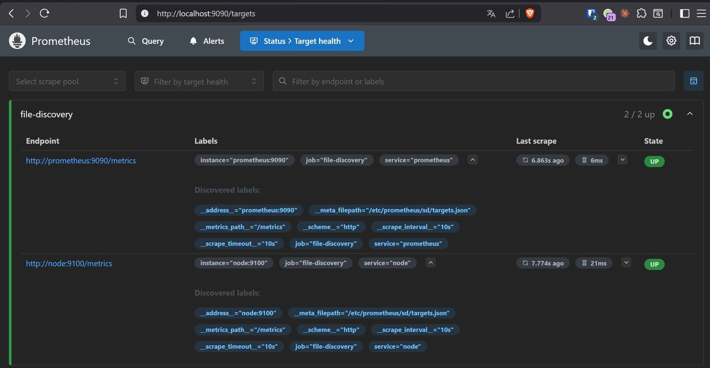

### Exercice 2 - Ecrire `prometheus.yml`

But :

- definir un `scrape_interval`
- ajouter un `external label`
- pouvoir recharger la configuration sans redemarrer le conteneur

A regarder :

- `prometheus.yml`
- `docker-compose.yml`

Points a comprendre :

- role de `global`
- role de `external_labels`
- utilite de `--web.enable-lifecycle`

Ce que j'ai ajoute :

```yaml
global:
  scrape_interval: 10s
  external_labels:
    environment: lab
```

Et dans `docker-compose.yml` pour autoriser le reload :

```yaml
prometheus:
  command:
    - "--config.file=/etc/prometheus/prometheus.yml"
    - "--web.enable-lifecycle"
```

Capture d'appui :

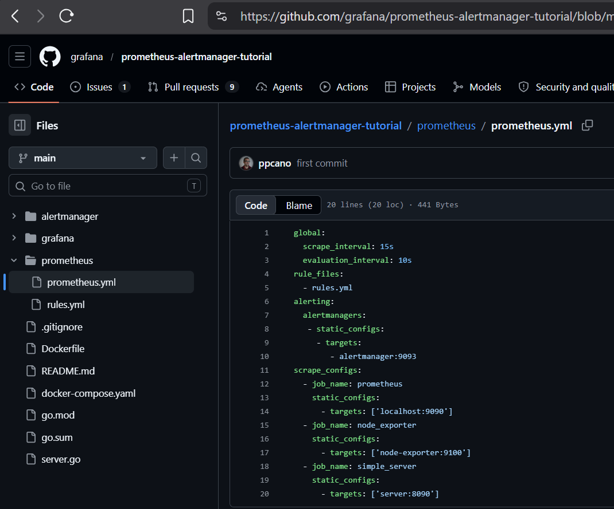

### Exercice 3 - Ajouter `node_exporter`

But :

- exposer les metriques systeme
- verifier que Prometheus les scrape correctement

A regarder :

- service `node` dans `docker-compose.yml`
- `targets.json`

Point utile :

- si la cible est `UP`, tu peux ensuite tester des metriques comme `node_cpu_seconds_total`

Ce que j'ai ajoute :

```yaml
node:
  image: prom/node-exporter:latest
  container_name: node
  ports:
    - "9100:9100"
```

Capture d'appui :


### Exercice 4 - Service discovery par fichier

But :

- remplacer une config statique par une decouverte dynamique

A regarder :

- `prometheus.yml`
- `targets.json`
- captures du dossier `image/`

Ce qu'il faut retenir :

- `file_sd_configs` permet a Prometheus de charger des cibles depuis un fichier JSON
- ici les 3 cibles sont `prometheus`, `node` et `demo-api`

Ce que j'ai ajoute :

Dans `prometheus.yml` :

```yaml
scrape_configs:
  - job_name: "file-discovery"
    file_sd_configs:
      - files:
          - /etc/prometheus/sd/*.json
        refresh_interval: 5s
```

Dans `targets.json` :

```json
[
  {
    "targets": ["prometheus:9090"],
    "labels": {
      "service": "prometheus"
    }
  },
  {
    "targets": ["node:9100"],
    "labels": {
      "service": "node"
    }
  },
  {
    "targets": ["demo-api:8000"],
    "labels": {
      "service": "demo-api"
    }
  }
]
```

Captures d'appui :

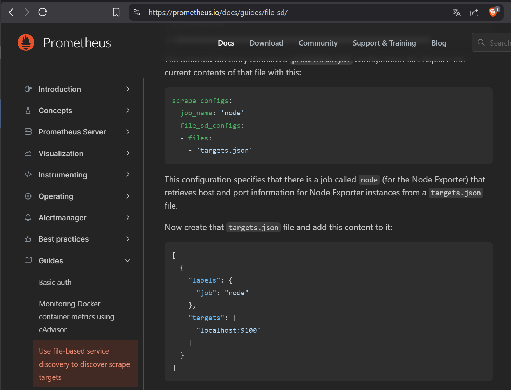
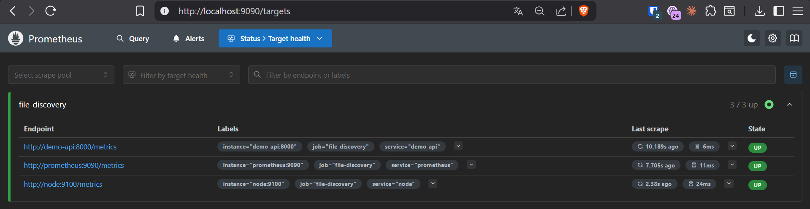

### Exercice 5 - Recording rules

But :

- enregistrer une requete PromQL sous forme de metrique pre-calculee

A regarder :

- `rules/api_rules.yml`
- `prometheus.yml`

Attention :

- le montage Docker doit pointer vers le dossier `rules/`, pas vers un seul fichier

Ce que j'ai ajoute :

Dans `prometheus.yml` :

```yaml
rule_files:
  - /etc/prometheus/rules/*.yml
  - /etc/prometheus/alerts/*.yml
```

Dans `docker-compose.yml` :

```yaml
prometheus:
  volumes:
    - ./rules:/etc/prometheus/rules
```

Dans `rules/api_rules.yml` :

```yaml
groups:
  - name: api.rules
    interval: 30s
    rules:
      - record: job:demo_http_requests:rate5m
        expr: sum by (job) (rate(demo_http_requests_total[5m]))
```

Captures d'appui :

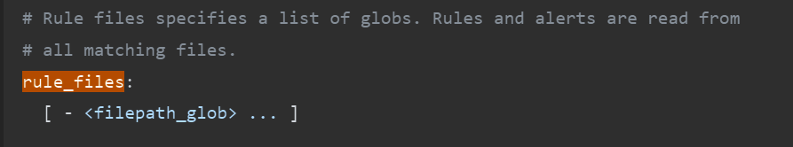
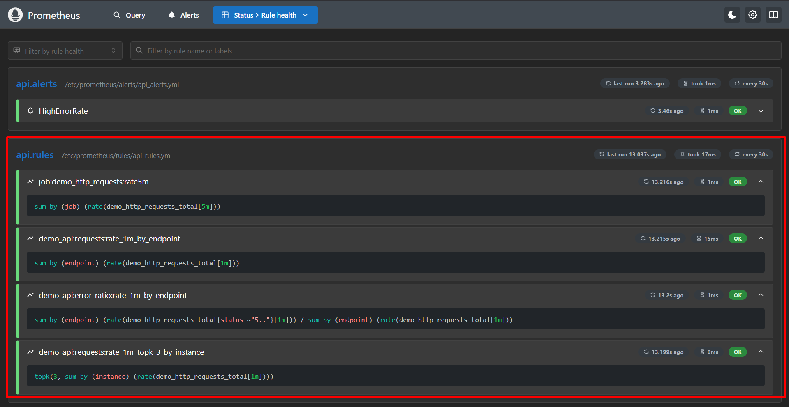

### Exercice 6 - Alertes et Alertmanager

But :

- declarer une alerte
- connecter Prometheus a Alertmanager
- verifier que la regle est bien chargee

A regarder :

- `alerts/api_alerts.yml`
- `alertmanager/alertmanager.yml`
- `prometheus.yml`

Points a comprendre :

- difference entre recording rule et alerting rule
- role du `for: 2m`
- cheminement Prometheus -> Alertmanager

Ce que j'ai ajoute :

Dans `docker-compose.yml` :

```yaml
alertmanager:
  image: prom/alertmanager:latest
  container_name: alertmanager
  ports:
    - "9093:9093"
  volumes:
    - ./alertmanager/alertmanager.yml:/etc/alertmanager/alertmanager.yml
  command:
    - "--config.file=/etc/alertmanager/alertmanager.yml"
```

Dans `prometheus.yml` :

```yaml
alerting:
  alertmanagers:
    - static_configs:
        - targets:
            - alertmanager:9093
```

Dans `alerts/api_alerts.yml` :

```yaml
groups:
  - name: api.alerts
    interval: 30s
    rules:
      - alert: HighErrorRate
        expr: |
          sum(rate(demo_http_requests_total{status=~"5.."}[2m]))
          /
          sum(rate(demo_http_requests_total[2m]))
          > 0.05
        for: 2m
        labels:
          severity: warning
```

Captures d'appui :

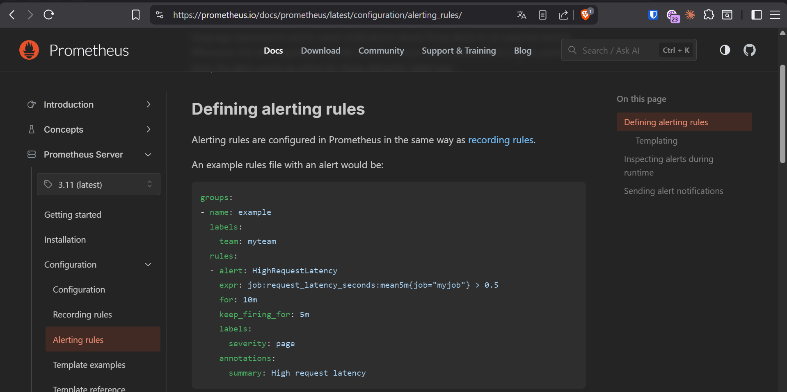
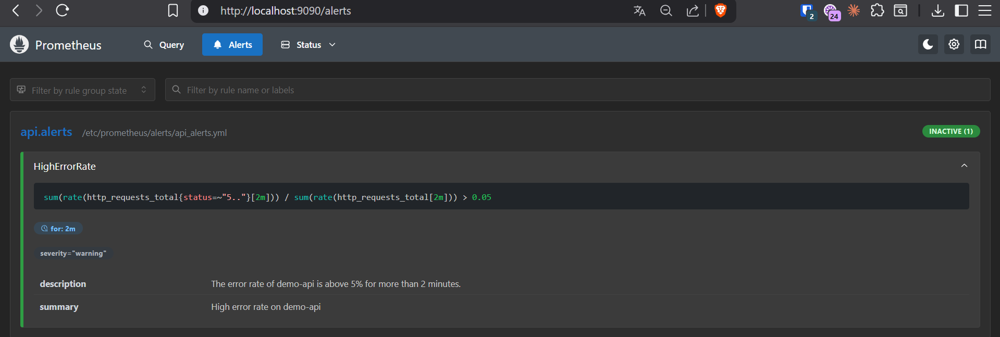

### Exercice 7 - Bases PromQL

But :

- distinguer vecteur instantane, vecteur de plage et scalaire

Metriques utiles :

- `demo_http_requests_total`

A faire dans Prometheus :

- tester la metrique seule
- tester la metrique avec `[1m]`
- tester `rate(...)`
- tester `scalar(sum(...))`

A observer :

- comment changent les resultats
- combien de series sont renvoyees
- quels labels permettent de separer les series

Ce que j'ai teste :

```promql
demo_http_requests_total
```

```promql
demo_http_requests_total[1m]
```

```promql
rate(demo_http_requests_total[1m])
```

```promql
scalar(sum(demo_http_requests_total))
```

Captures d'appui :

`demo_http_requests_total`

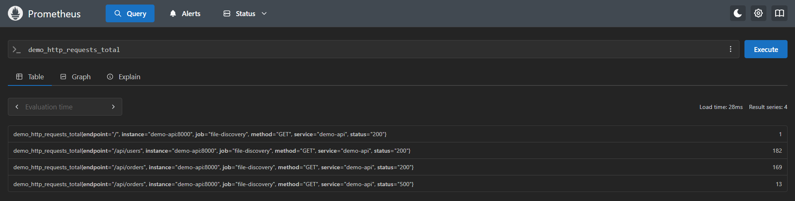

`demo_http_requests_total[1m]`

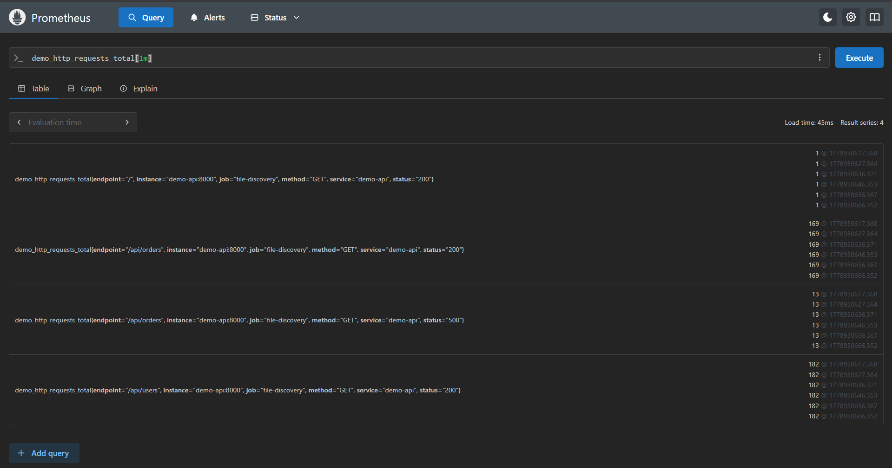

`rate(demo_http_requests_total[1m])`

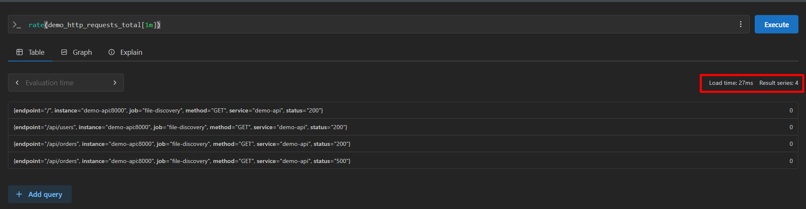

`scalar(sum(demo_http_requests_total))`

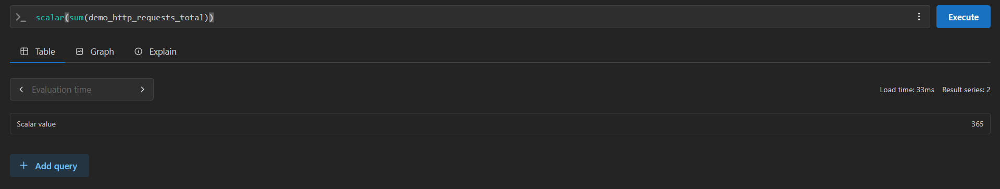

Labels du compteur dans `app.py` :

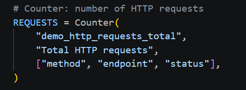

### Exercice 8 - Agregations et `topk`

But :

- manipuler `sum by (...)`
- calculer un ratio d'erreurs
- classer les plus grosses series

A regarder :

- `rules/api_rules.yml`
- `app.py`

Point tres important :

- dans ce projet Docker Compose, il faut raisonner avec `instance`
- dans un contexte Kubernetes, l'enonce parle plutot de `pod`

Autre point important :

- dans `app.py`, le compteur principal utilise les labels `method`, `endpoint` et `status`

Ce que j'ai ajoute :

Dans `rules/api_rules.yml` :

```yaml
- record: demo_api:requests:rate1m_by_endpoint
  expr: |
    sum by (endpoint) (
      rate(demo_http_requests_total[1m])
    )

- record: demo_api:error_ratio:rate1m_by_endpoint
  expr: |
    sum by (endpoint) (
      rate(demo_http_requests_total{status=~"5.."}[1m])
    )
    /
    sum by (endpoint) (
      rate(demo_http_requests_total[1m])
    )

- record: demo_api:requests:rate1m_top3_by_instance
  expr: |
    topk(3,
      sum by (instance) (
        rate(demo_http_requests_total[1m])
      )
    )
```

Les requetes a comprendre derriere ces regles :

```promql
sum by (endpoint) (rate(demo_http_requests_total[1m]))
```

```promql
sum by (endpoint) (rate(demo_http_requests_total{status=~"5.."}[1m]))
/
sum by (endpoint) (rate(demo_http_requests_total[1m]))
```

```promql
topk(3, sum by (instance) (rate(demo_http_requests_total[1m])))
```

Captures d'appui :

Pour comprendre `instance` dans Docker Compose :

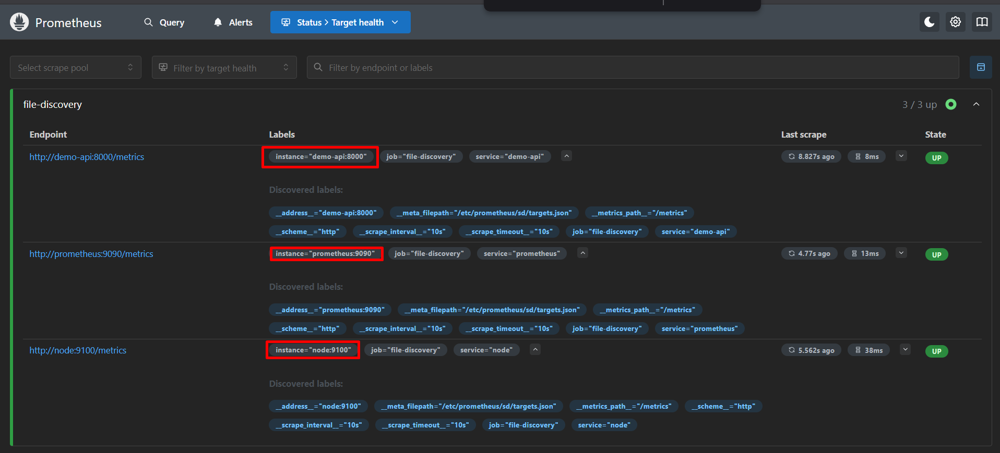
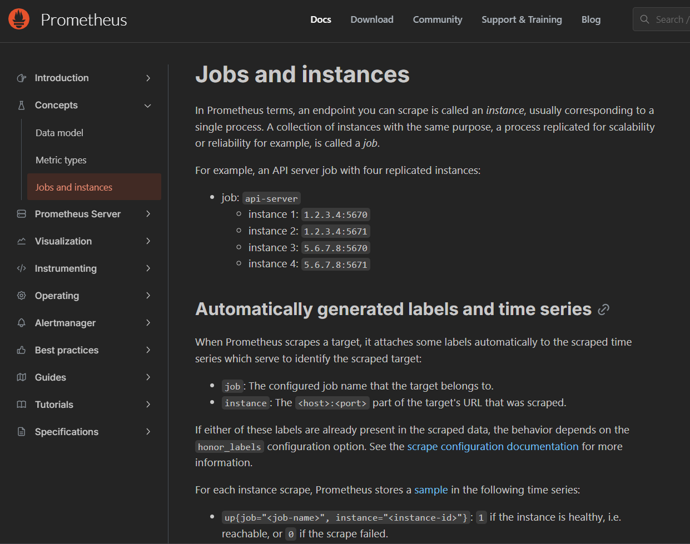

Pour revoir la logique PromQL :

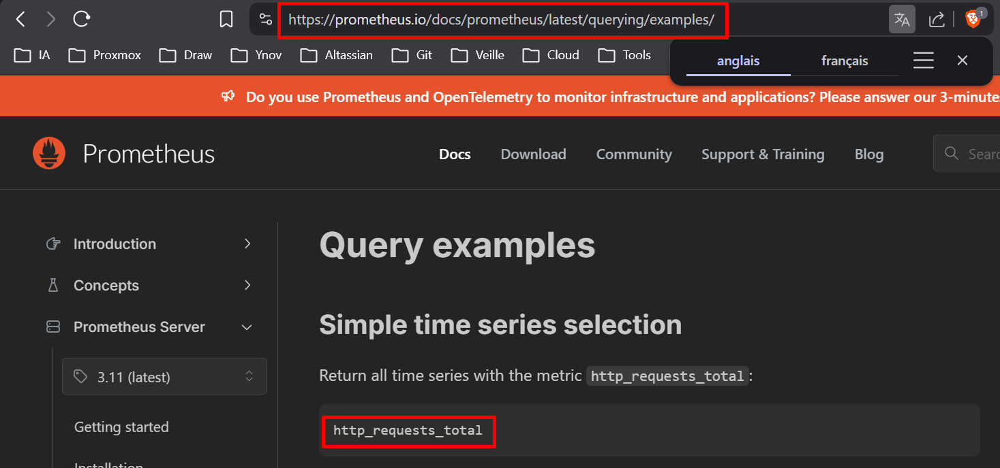
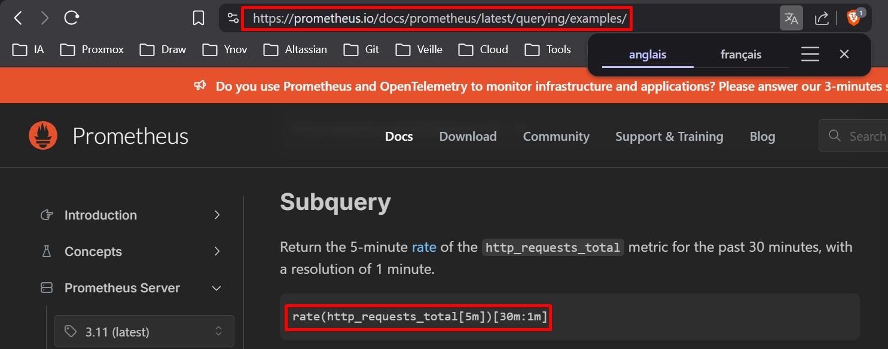
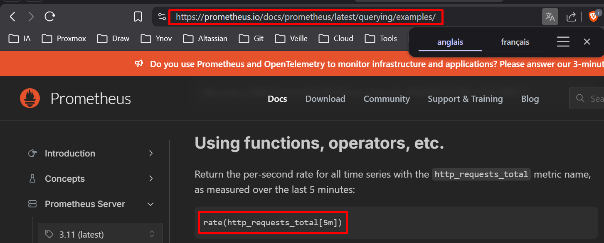
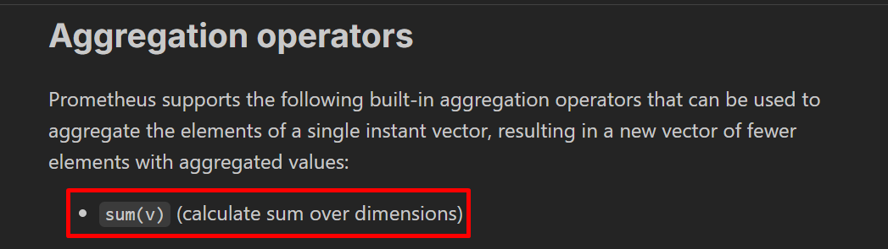
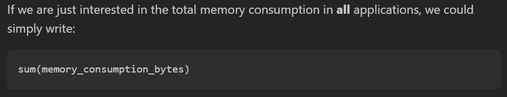

Pour verifier les regles creees dans le TP :


### Exercice 9 - Histogrammes et quantiles

But :

- utiliser les buckets exposes par l'histogramme
- calculer une latence `p95`
- tester `predict_linear`

A regarder :

- `rules/api_rules.yml`
- `app.py`
- les captures de `image/`

Metriques utiles :

- `demo_http_request_duration_seconds_bucket`
- `demo_http_requests_total`

Ce qu'il faut travailler :

- comprendre la structure d'un histogramme Prometheus
- comprendre pourquoi `histogram_quantile(...)` s'appuie sur les series `_bucket`
- comparer la consigne du TP et la doc sur `predict_linear`

Ce que j'ai ajoute :

Dans `rules/api_rules.yml` :

```yaml
- record: demo_api:orders_latency:p95_5m
  expr: |
    histogram_quantile(
      0.95,
      sum by (le, endpoint) (
        rate(demo_http_request_duration_seconds_bucket{endpoint="/api/orders"}[5m])
      )
    )

- record: demo_api:orders_latency:p95_5m_ms
  expr: |
    1000 *
    histogram_quantile(
      0.95,
      sum by (le, endpoint) (
        rate(demo_http_request_duration_seconds_bucket{endpoint="/api/orders"}[5m])
      )
    )

- record: demo_api:requests:predict_1h_total
  expr: |
    predict_linear(
      sum(demo_http_requests_total)[5m:10s],
      3600
    )

- record: demo_api:requests:predict_1h_by_endpoint
  expr: |
    predict_linear(
      sum by (endpoint) (demo_http_requests_total)[5m:10s],
      3600
    )
```

Les requetes a comprendre :

```promql
histogram_quantile(
  0.95,
  sum by (le, endpoint) (
    rate(demo_http_request_duration_seconds_bucket{endpoint="/api/orders"}[5m])
  )
)
```

```promql
predict_linear(demo_http_requests_total[1h], 3600)
```

Captures d'appui :

Latence p95 sur `/api/orders` :

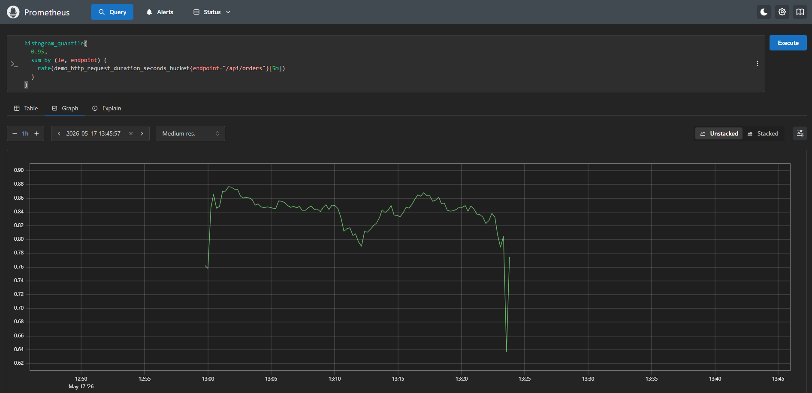

Projection avec `predict_linear` :

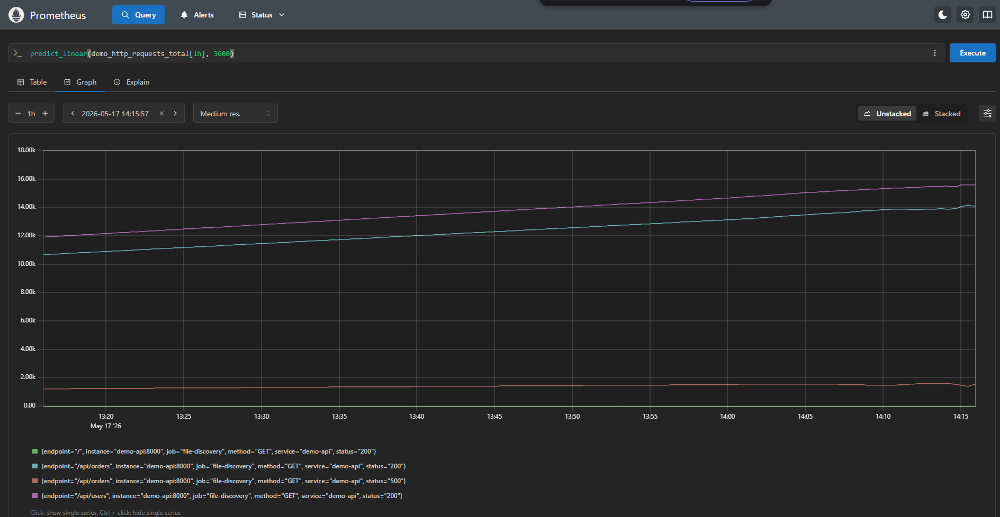

Doc Prometheus sur `predict_linear` :

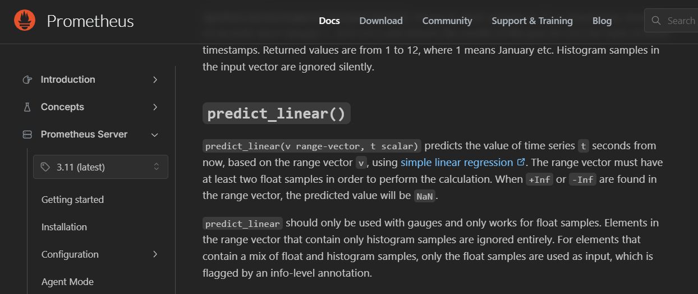

## Pour continuer

### Exercice 10

Tu peux enchainer directement avec :

- construction de l'image `demo-api`
- ajout d'un job de scrape dedie si tu veux separer sa collecte
- verification des metriques `demo_*`

### Module 2 - Grafana

Quand tu auras termine Prometheus, la suite naturelle sera :

- brancher Grafana
- ajouter Prometheus en datasource
- creer un dashboard pour `demo-api`

### Module 3 - Thanos

Enfin, tu pourras continuer sur :

- sidecar
- stockage objet
- querier
- compactor
- deduplication

## Captures

Le dossier `image/` contient :

- le sujet du TP
- des captures de doc Prometheus
- des captures de l'interface Prometheus

Elles servent surtout d'appui pour se reperer pendant les exercices.
